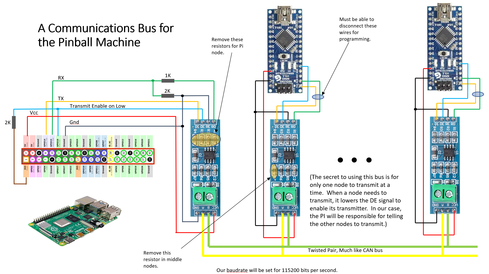

# Pinball
Software for our pinball machine, Fall 2022

We built a pinball machine in the Fall of 2022.  The machine has lots of features, such as flippers, sling shots, jet bumpers, drop hole, plungers, and lots and lots of lights.  It also has a score board (box) behind
the play area that has a monitor, speakers, and lots of neopixels, and 12 volt car lights.  

The machine is managed by a Raspberry Pi in the score box.  The Pi talks to a network of Arduino Nanos on a
RS-485 bus.  The Nanos control the flippers, bumpers, kickers, lights, and monitor the switches.  The network
is pictured below.

This repository contains the code for the Pi as well as all the Arduino "nodes".  It also contains some of 
the documentation that was writen as the machine was developed.

